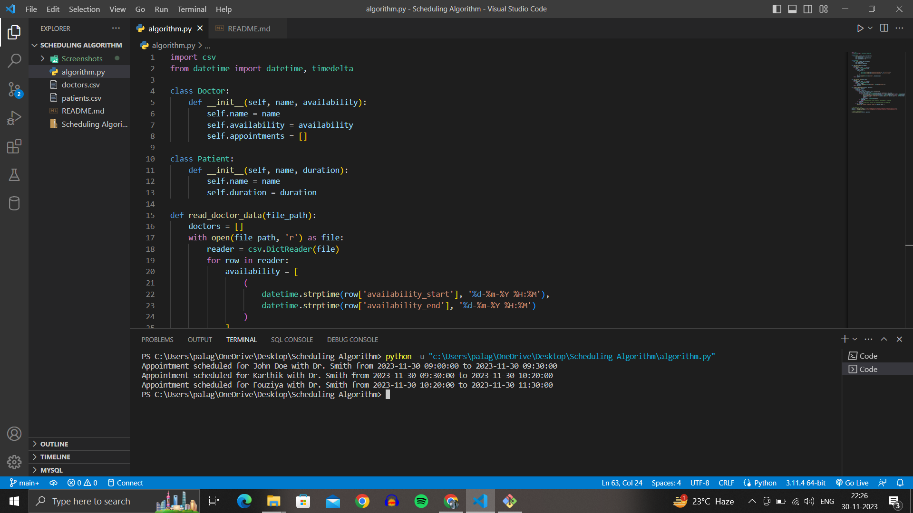

# Appointment Scheduling Algorithm

This repository contains a Python algorithm for efficient appointment scheduling. The algorithm considers factors such as appointment duration and doctor availability.

## Getting Started

Follow these instructions to get a copy of the project and run it on your local machine.

### Prerequisites

Make sure you have Python installed on your machine.

### Installation

## 1. Clone the repository:

   ```bash
   git clone https://github.com/your-username/appointment-scheduling.git
   cd appointment-scheduling

```
# 2. Install the required dependencies:

```bash

pip install -r requirements.txt

```
Prepare your doctor and patient data in CSV files.
Example CSV files are provided in the repository:

doctors.csv: Contains doctor names, availability start, and end times.
patients.csv: Contains patient names and appointment durations.
Run the scheduling algorithm:

```bash

python algorithm.py

```
The algorithm will read data from the CSV files, schedule appointments, and print the results.

Example Data
doctors.csv
csv
```bash
name,availability_start,availability_end
Dr. Smith,30-11-2023 09:00,30-11-2023 12:00
Dr. Johnson,30-11-2023 13:00,30-11-2023 17:00

```


patients.csv
```bash

name,duration
John Doe,30
Jane Smith,60
Bob Johnson,45

```

# SCREENSHOTS OF DATASET : 

**Patients :**


**Doctors :**


## OUTPUT : 

